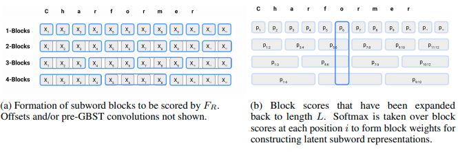

</img>

## Charformer - Pytorch (wip)

Implementation of the GBST (gradient-based subword tokenization) module from the <a href="https://arxiv.org/abs/2106.12672">Charformer paper</a>, in Pytorch. The paper proposes a module that automatically learns subword representations, obviating the need for tokenizers in the encoder setting.

<a href="https://www.youtube.com/watch?v=debgj24BAZE">AI Coffee Break with Letitia video</a>

## Citations

```bibtex
@misc{tay2021charformer,
    title   = {Charformer: Fast Character Transformers via Gradient-based Subword Tokenization}, 
    author  = {Yi Tay and Vinh Q. Tran and Sebastian Ruder and Jai Gupta and Hyung Won Chung and Dara Bahri and Zhen Qin and Simon Baumgartner and Cong Yu and Donald Metzler},
    year    = {2021},
    eprint  = {2106.12672},
    archivePrefix = {arXiv},
    primaryClass = {cs.CL}
}
```
